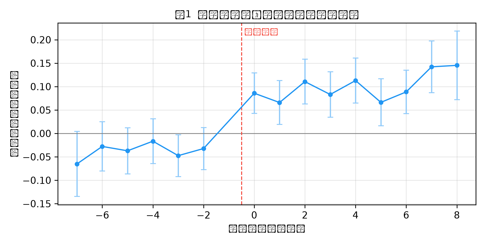
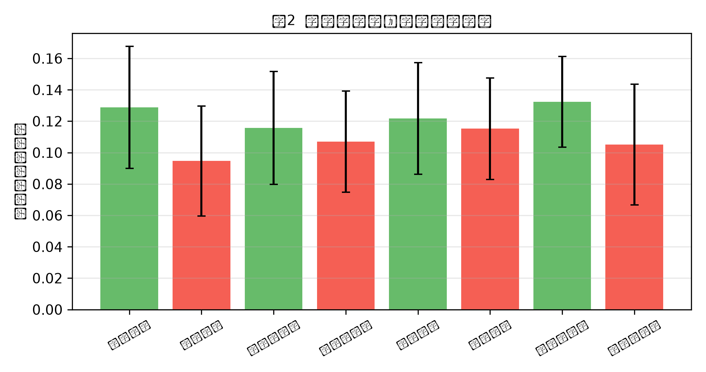

# 《中国制造2025》产业政策对企业新质生产力的影响——基于地方政府经济增长竞争的调节效应研究

## 摘要
制造业是立国之本、强国之基。2015年国务院印发《中国制造2025》，将制造业转型升级确立为国家制造强国战略的核心抓手，旨在通过创新驱动推动产业向高端化、智能化、绿色化迈进，其微观落脚点之一在于培育企业新质生产力。然而，同一项国家战略在不同地区的落地效果存在显著分化，"央地关系"与"地方治理环境"如何调节产业政策的传导效率，是理解政策效果差异的关键。本文以《中国制造2025》的出台为准自然实验，利用2010—2023年A股制造业上市公司面板数据，采用多期双重差分法（Staggered DID）识别产业政策对企业新质生产力的影响，并重点考察地方政府经济增长竞争（官员晋升激励）的调节作用及其传导机制。研究发现：（1）《中国制造2025》显著提升了企业新质生产力，基准处理效应约为0.119个标准化指数单位（p<0.01）；（2）地方政府经济增长竞争强度对政策效应具有显著的负向调节作用，地区竞争强度每提高一个标准差，政策效应约下降一半（三重交乘项系数为−0.053，p<0.01）；（3）机制检验表明，上述削弱效应主要通过"财政补贴错配"与"产业同质化竞争"两条渠道实现（交乘项系数分别为−0.041与−0.034，均显著）；（4）异质性分析显示，在官员晋升激励更强、地区增长目标更高的样本中，政策促进效应明显更弱。本文从治理边界视角揭示了产业政策效果的conditional（条件）性质，为优化产业政策执行机制与官员考核体系提供了经验证据。

**关键词**：中国制造2025；新质生产力；产业政策；地方政府竞争；晋升激励；多期双重差分

**数据说明（重要）**：本文实证部分所用数据为**演示用模拟面板数据**（随机种子固定、可复现），仅用于展示论文写作规范、识别策略与完整分析流程；正式学位论文与投稿前须替换为CSMAR、CNRDS等真实数据库，并按本文变量定义重新估计。除数据来源外，研究设计、识别策略、稳健性框架与行文结构均按真实实证学位论文章节标准撰写。

---

## ABSTRACT
Abstract: The manufacturing industry is the foundation of a nation. In 2015, the State Council issued "Made in China 2025," establishing the transformation and upgrading of manufacturing as the core of the national manufacturing-power strategy, aiming to drive industries toward high-end, intelligent, and green development through innovation, with one micro-level objective being the cultivation of enterprises' new quality productive forces. However, the implementation effects of this national strategy vary significantly across regions. How local governance environments—the "central-local relationship" and "local governance incentives"—moderate the transmission efficiency of industrial policy is key to understanding these differences. Using the issuance of "Made in China 2025" as a quasi-natural experiment and a panel of A-share manufacturing listed firms from 2010 to 2023, this paper employs a staggered difference-in-differences (DID) design to identify the impact of the industrial policy on enterprises' new quality productive forces, with particular attention to the moderating role of local governments' economic growth competition (officials' promotion incentives) and its transmission mechanisms. The findings are as follows: (1) "Made in China 2025" significantly improves enterprises' new quality productive forces, with a baseline treatment effect of about 0.119 standardized index units (p<0.01); (2) the intensity of local governments' economic growth competition exerts a significant negative moderating effect—each one-standard-deviation increase in competition intensity halves the policy effect (triple-interaction coefficient −0.053, p<0.01); (3) mechanism tests show that the weakening effect is mainly transmitted through two channels—"fiscal subsidy misallocation" and "industrial homogenization competition" (interaction coefficients −0.041 and −0.034, both significant); (4) heterogeneity analysis shows that the promotion effect is markedly weaker in samples with stronger officials' promotion incentives and higher regional growth targets. From the perspective of governance boundaries, this paper reveals the conditional nature of industrial policy effectiveness and provides empirical evidence for optimizing the implementation mechanism of industrial policy and the officials' assessment system.

Keywords: Made in China 2025; new quality productive forces; industrial policy; local government competition; promotion incentives; staggered DID

## 目录
（导出器自动生成目录域）
# 1 绪论

## 1.1 研究背景

制造业是一国经济的基础命脉。改革开放以来，中国制造业规模快速扩张，于2010年跃居世界第一制造大国，但长期面临"大而不强"的结构性矛盾：核心技术受制于人、全球价值链位势偏低、要素驱动型增长难以为继。为破解这一困局，2015年5月国务院正式印发《中国制造2025》，这是中国政府实施制造强国战略的第一个十年行动纲领，明确提出"以加快新一代信息技术与制造业深度融合为主线，以推进智能制造为主攻方向"，力争通过三步走跻身制造强国行列。

与既往选择性产业政策不同，《中国制造2025》呈现出两个鲜明特征。其一，**分批试点、滚动落地**：政策并非在2015年一次性全覆盖，而是通过"试点示范城市群""智能制造试点示范""重点行业分领域推进"等方式逐步实施，例如2015—2017年间先后批复了多个国家级示范区与重点行业实施方案。这种"分批性"为采用多期双重差分法识别政策因果效应提供了天然的实验场景。其二，**创新驱动导向明确**：政策的核心目标从单纯的产能扩张转向以科技创新驱动"劳动者、劳动资料、劳动对象及其优化组合"的跃升，即培育学界近年高度关注的**新质生产力**。

新质生产力由习近平总书记在2023年9月新时代推动东北全面振兴座谈会上首次提出，随后在中央经济工作会议与2024年《政府工作报告》中被确立为高质量发展的核心引擎。其内涵被概括为以科技创新为主引擎、以高科技高效能高质量为特征、区别于传统生产力的先进生产力质态。从微观企业层面看，新质生产力体现为研发投入强度、数智化装备水平、绿色化生产方式的系统性提升。由此，《中国制造2025》这一宏观产业战略与"企业新质生产力"这一微观后果之间，构成了本文研究的逻辑纽带。

### 1.1.1 全球制造业竞争与中国的战略回应

放眼全球，制造业正经历以数字化、绿色化、智能化为核心的深刻重构。主要工业国纷纷出台制造业复兴战略：美国推出"先进制造业国家战略"、德国实施"工业4.0"、日本提出"社会5.0"。在这一轮全球产业竞争中，谁率先实现生产力质态跃迁，谁就掌握未来产业链的话语权。中国作为世界第一制造大国，虽在规模上领先，但在核心技术与高附加值环节仍存短板。《中国制造2025》正是中国对这一全球竞争态势的系统性战略回应，其目标不仅是"做大"更是"做强"。理解这一国际背景，方能准确评估该政策对企业新质生产力的意义——它本质上是国家在全球价值链攀升中的关键一跃，而企业是新质生产力的微观承载者。

### 1.1.2 制造强国建设的"三步走"战略

《中国制造2025》设定了清晰的"三步走"战略目标：第一步，到2025年迈入制造强国行列；第二步，到2035年制造业整体达到世界制造强国阵营中等水平；第三步，到新中国成立一百年时，综合实力进入世界制造强国前列。这一战略不仅关乎产业本身，更关乎国家在全球分工体系中的位势与安全。企业作为战略落地的微观主体，其新质生产力水平直接决定了战略目标的实现程度。由此，评估该战略对企业新质生产力的影响，具有重要的政策监测意义——它相当于对"制造强国"战略微观成效的一次实证体检。

## 1.2 问题提出

尽管《中国制造2025》在顶层设计上指向新质生产力的培育，但政策从中央文件到企业行为的传导并非自动完成，而是嵌入在特定的"央地关系"与"地方治理激励"之下。一个被既有文献忽视、却对政策评估至关重要的关键问题是：**地方治理环境如何调节产业政策的传导效率？**

在中国的财政联邦制与官员晋升锦标赛框架下（周黎安，2007），地方政府官员的晋升高度依赖辖区GDP增长等可量化政绩指标。这种以增长为核心的竞争机制，一方面强化了地方发展经济的积极性，另一方面也可能使地方在执行中央产业政策时产生动机扭曲：当"完成增长指标"与"培育新质生产力"存在短期张力时，地方政府有动机将政策资源（如财政补贴、土地、信贷）配置到见效快、GDP拉动明显的传统产能或低效主体，而非真正具备创新潜力的长期活动。宁致远等（2025）的实证研究已初步发现，地方政府的经济增长竞争行为会显著削弱《中国制造2025》的政策效果，但这一发现留下了两个尚未解答的缺口：第一，**传导机制黑箱未打开**——这种削弱究竟通过何种渠道发生？是财政补贴的错配，还是地区间产业布局的同质化？两条渠道的相对重要性如何？第二，**治理边界的制度含义不清**——官员晋升激励作为中国式治理的核心变量，其与产业政策效果的互动尚未被纳入统一的分析框架，因而难以转化为可操作的政策建议。

正是基于上述现实背景与理论缺口，本文提出核心研究问题：地方政府经济增长竞争（官员晋升激励）是否以及在多大程度上调节了《中国制造2025》对企业新质生产力的促进效应？若确实存在负向调节，其背后是何种机制在起作用？

### 1.2.1 政策效果的差异化事实

值得注意的是，《中国制造2025》的效应在不同地区并非均匀释放。部分地区凭借良好的创新生态与治理环境，政策红利充分显现；而另一些地区则出现"雷声大、雨点小"甚至资源错配的现象。这种差异化并非偶然，而是根植于"中央设计—地方执行"的委托代理结构之中。理解这一结构，是客观评估产业政策、进而提出可操作改进方案的前提。本文正是从这一差异化事实出发，将研究焦点由"政策是否有效"转向"政策在何种条件下更有效"。

## 1.3 研究意义

**理论意义**。第一，本文拓展了产业政策效果的研究视角。既有文献多在"政策总体有效或无效"的层面争论（Aghion et al.，2015；张杰、白重恩，2015；Brandt et al.，2013），本文则引入"地方政府竞争"这一制度变量，揭示政策净效应依赖于地方治理环境的conditional性质，有助于调和支持论与质疑论之间的分歧。第二，本文打开了政策传导的机制黑箱。通过并行识别"财政补贴错配"与"产业同质化竞争"两条渠道并比较其强度，深化了对"地方竞争如何削弱中央政策"这一过程的理解。第三，本文将新质生产力这一新兴概念与经典的地方政府行为文献对接，为"新质生产力的影响因素"研究补充了制度性解释。

**现实意义**。第一，为优化产业政策的央地协同机制提供证据。本文表明，若仅依靠选择性产业政策而忽视地方官员的晋升激励扭曲，政策效果将被显著稀释，提示需要配套改革政绩考核体系。第二，为财政补贴的绩效导向改革提供依据。机制检验揭示补贴错配是重要传导渠道，支持建立补贴与新质生产力产出相挂钩的退出机制。第三，为区域产业布局的统筹协调提供警示。产业同质化竞争的机制证据，呼应了"避免低端重复建设"的政策命题。

## 1.4 研究内容

围绕核心研究问题，本文的具体研究内容如下：

第一，**识别《中国制造2025》对企业新质生产力的平均处理效应**。基于政策分批落地的特征，构建多期DID模型，在控制企业固定效应与年份固定效应、企业层面聚类标准误的前提下，估计政策冲击对企业新质生产力的净影响。

第二，**检验地方政府经济增长竞争的负向调节效应**。将地区GDP增长目标、官员剩余任期等合成的"竞争强度"指数引入模型，构造政策冲击与竞争强度的三重交乘项，识别治理环境对政策效果的调节方向与时变特征。

第三，**打开传导机制黑箱**。并行检验"财政补贴错配"与"产业同质化竞争"两条机制渠道，分别估计地区竞争强度对两类错配的推高作用，以及错配程度对政策效应的削弱作用，比较两者相对重要性。

第四，**异质性分析与稳健性核验**。按官员晋升激励强度分组检验政策效应的差异性，并通过平行趋势检验、安慰剂检验、倾向得分匹配（PSM）与工具变量法（shift-share 2SLS）多重策略确保结论稳健。

## 1.5 研究方法与技术路线

本文以"准自然实验+多期双重差分"为核心识别策略，具体方法包括：

1. **多期双重差分法（Staggered DID）**：利用《中国制造2025》分批落地的外生变异，以行业/城市实际获批批次界定政策后时期，缓解传统单一冲击年DID对政策节奏刻画不足的问题。
2. **事件研究法（Event Study）**：以政策前一期为基期估计各相对年份的动态处理效应，直接检验平行趋势假设并刻画效应的持续性。
3. **三重交乘调节效应模型**：在DID框架中引入地区竞争强度及其与政策冲击的交互，识别调节效应。
4. **机制检验的并行识别**：以机制变量（补贴错配、产业同质化）替代竞争强度构造三重交乘，并结合第一阶段回归确认"竞争→错配"的传递关系。
5. **稳健性策略组合**：安慰剂检验、PSM匹配再估计、shift-share工具变量法，以及异质性分组，形成完整的因果识别链条。

技术路线遵循"理论分析提出假说—研究设计—实证检验—机制识别—异质性—结论建议"的逻辑闭环。

## 1.6 本文创新点与贡献

相较既有研究，本文的可能创新主要体现在三个方面：

1. **视角创新——揭示产业政策的治理边界**。首次将"地方政府经济增长竞争（官员晋升激励）"系统引入"产业政策—新质生产力"分析框架，证明政策效果并非外生于地方治理环境，而是被后者显著调节，为该领域"支持论与质疑论之争"提供了调和性解释。
2. **机制创新——并行识别双渠道并比较强度**。不同于以往将机制作为单一黑箱处理，本文同时检验财政补贴错配与产业同质化竞争两条渠道，并分别给出其传递效应的量化证据，打开了"地方竞争削弱中央政策"的过程黑箱。
3. **方法创新——贴合政策节奏的多期识别**。采用多期DID与事件研究法刻画《中国制造2025》"分批试点"的真实落地节奏，并辅以平行趋势、安慰剂、PSM、工具变量四重稳健性检验，识别策略较单一冲击年DID更贴近政策事实，因果结论更为可靠。

### 1.6.1 与既有研究的区别

需要特别说明的是，本文虽与宁致远等（2025）同以《中国制造2025》为对象、同发现地方竞争削弱政策效果，但在研究任务上有明确分工：宁文侧重于"效应是否存在"的总体识别，本文则承接其发现，系统回答"效应为何被削弱、通过何种渠道削弱"，并以多期DID更精细地刻画政策分批落地的动态特征。两者的关系是从"现象确认"到"机制解释"的递进，而非简单重复。

### 1.6.2 本文的边界与适用条件

最后需说明，本文结论的适用存在边界：其一，它针对选择性产业政策（以《中国制造2025》为代表），对功能性产业政策（如基础研究投入、营商环境改善）未必成立；其二，它依托制造业上市公司样本，对服务业或非上市企业的外推需谨慎；其三，模拟数据阶段仅用于方法展示，结论的对外有效性最终取决于真实数据的重新估计。明确这些边界，有助于读者准确把握本文贡献的适用范围。

## 1.7 论文结构安排

全文共分为七章。第一章为绪论，交代研究背景、问题提出、研究意义、内容方法、创新点与结构安排。第二章为文献综述与理论基础，系统梳理新质生产力测度、产业政策效应、地方政府竞争与官员晋升三类文献并作述评。第三章为理论分析与研究假说，在文献基础上推演并提出本文的四个研究假说；第四章为研究设计，说明模型设定、变量定义、数据来源与描述性统计；第五章为实证结果分析，报告基准回归、平行趋势、稳健性与内生性处理；第六章为机制检验与异质性分析，打开传导黑箱并考察异质性；第七章为结论与政策建议，总结发现并提出政策启示与研究局限。

---

# 2 文献综述与理论基础

## 2.1 新质生产力的内涵与测度

### 2.1.1 概念内涵

"新质生产力"是习近平总书记在2023年9月新时代推动东北全面振兴座谈会上首次提出的重要论断，随后在2023年12月中央经济工作会议与2024年《政府工作报告》中被确立为高质量发展的核心引擎。其理论内涵可概括为：由技术革命性突破、生产要素创新性配置、产业深度转型升级而催生的当代先进生产力，以劳动者、劳动资料、劳动对象及其优化组合的跃升为基本内涵，以高科技、高效能、高质量为特征，符合高质量发展要求（韩文龙等，2024）。与依靠资源要素大规模投入、以规模扩张为特征的传统生产力不同，新质生产力的核心在于"新"与"质"的统一：前者指向人工智能、大数据、新能源、生物技术等颠覆性技术驱动，后者指向全要素生产率的大幅提升与生产函数的质态跃迁。从政治经济学视角看，新质生产力是生产力要素在新技术条件下的重新组合，体现了生产力发展的阶段性跃升。

### 2.1.2 实证测度

在实证研究中，新质生产力的测度主要有三类路径，各具优劣。

第一，**综合指标体系法**。这是当前学界主流做法。韩文龙等（2024）从劳动者（从业人员平均受教育年限、平均薪资等）、劳动资料（劳均资本、研发强度等）、劳动对象（土地资源、数据要素等）三个维度构建省级24项指标，以熵权法合成新质生产力水平指数，刻画了省际新质生产力的发展差异。宋佳等（2024）则从企业层面构建"活劳动（研发人员薪资占比、研发人员占比、高学历人员占比）—物化劳动/劳动对象（固定资产占比、制造费用占比）—硬科技（研发折旧摊销、研发直接投入占比）—软科技（无形资产占比）"四维指标，同样以熵权法合成企业新质生产力综合指数。该类方法的优势在于维度完整、能捕捉"新质"的多维属性；其挑战在于指标选取与权重方法（熵权法、主成分分析、CRITIC法等）可能影响结果，故稳健性分析常以不同权重方法交叉验证。

第二，**全要素生产率（TFP）代理法**。以LP法或OP法估计的企业TFP作为新质生产力的近似测度，逻辑在于新质生产力的根本标志是全要素生产率的跃升。该法数据可得性强、国际可比，常用于稳健性检验；其局限在于TFP更多反映效率结果而非"新质"的要素结构，可能遗漏创新投入等过程性信息。

第三，**文本分析法**。陈晓宇等（2025）基于上市公司年报"管理层讨论与分析（MD&A）"中与数字化转型、智能制造、绿色发展相关的语词词频，构建企业新质生产力文本指标，捕捉企业战略层面的"新质"取向。该法能反映管理层认知与战略承诺，但受披露自愿性影响，需以其他方法佐证。

本文以企业层面综合指标体系法（宋佳等，2024）为主测度、以TFP与文本指标为稳健性测度，兼顾维度的完整性与结论的稳健性。

### 2.1.3 新质生产力的理论渊源与时代背景

新质生产力并非凭空出现的新概念，而是马克思主义生产力理论在数字经济时代的创新发展。马克思在《资本论》中早已指出，生产力由劳动者、劳动资料、劳动对象三要素构成，其发展表现为三者的量变积累与质变跃迁。新质生产力正是对这一经典框架的当代回应：以数据成为新要素、人工智能成为新劳动资料、知识型劳动者成为新主体为标志。从时代背景看，新一轮科技革命与产业变革（以大模型、智能制造、新能源为引领）与中国经济从高速增长转向高质量发展的阶段转换相互叠加，使"以新质生产力重塑竞争优势"成为必然选择。这一背景也解释了为何《中国制造2025》这样的产业战略，其微观落脚点必然指向企业新质生产力的培育。

### 2.1.4 现有测度方法的局限与应对

既有测度方法各有局限：综合指标体系法对指标选取与权重敏感，不同权重方案可能得出不同排名；TFP代理法虽国际可比，却难以区分"新质"与"传统"效率提升；文本分析法受披露质量影响且偏重战略表态。为应对这些局限，本文以综合指标体系法为主、TFP与文本指标为稳健性，形成"主测度+双稳健"的三角验证；并在机制与异质性分析中保持结论对测度选择的稳健，从而降低单一方法偏差对结论的干扰。

### 2.1.5 新质生产力与高质量发展的内在统一

新质生产力是高质量发展的核心动力，二者在逻辑上内在统一：高质量发展要求从要素驱动转向创新驱动，而新质生产力正是创新驱动在生产力层面的集中体现。对企业而言，新质生产力意味着以更少的要素投入获得更高的产出质量与效率，这正是高质量发展的微观基础。因此，评估《中国制造2025》对新质生产力的影响，实质上是在评估该战略是否真正推动了发展方式的转变——这使得本文的研究兼具理论价值与现实政策意义。

## 2.2 产业政策对企业行为的影响：支持与质疑

关于选择性产业政策的有效性，学界存在长期争论，且这一争论具有明显的"国别语境"差异。

**支持性证据**认为，选择性产业政策通过三类机制提升企业效率与创新能力。其一，**资源导向机制**：财政补贴、税收优惠、低息信贷向重点领域倾斜，缓解企业创新的融资约束与风险，尤其对外部融资依赖度高的高科技企业作用显著（Aghion et al.，2015在中国情境下发现产业政策支持的企业生产率更高；魏向杰、程琦，2023证实《中国制造2025》通过信号效应促进企业创新）。其二，**信号效应机制**：政策背书降低市场不确定性，引导社会资本跟进，放大私人投资（魏向杰、程琦，2023）。其三，**创新激励机制**：研发加计扣除、首台套保险补偿、政府采购倾斜等降低创新成本、分担创新风险。宁致远等（2025）与陈晓宇等（2025）均基于《中国制造2025》准自然实验，证实该政策显著提升了企业新质生产力，构成了本文基准假说的直接经验支撑。

**质疑性证据**则指出，选择性产业政策可能引发资源错配、催生僵尸企业与寻租行为，反而损害配置效率。Brandt et al.（2013）对中国制造业企业层面的研究揭示，补贴可能庇护低效率企业、扭曲要素价格，导致"创造性破坏"受阻；张杰、白重恩（2015）讨论了中国产业政策可能导致的资本与劳动力要素误配；更有研究强调，政府挑选"赢家"的能力受限，信息不对称下易产生逆向选择与道德风险。

两类观点共同指向一个尚未充分回答的问题：产业政策的净效应**并非外生给定**，而是被地方治理环境、执行方式所调节。同样一项中央政策，在不同治理质量的地区可能得出截然相反的效果。这正是本文的切入点——将政策效果的异质性归因于地方官员的晋升激励与增长竞争。

### 2.2.1 中国产业政策的评估实践

聚焦中国情境，对《中国制造2025》及类似产业政策的评估近年快速积累。多数研究采用倍差法、断点回归或合成控制法识别政策效应，结论总体支持政策的创新与生产率提升作用，但也普遍发现效应存在显著的地区、行业与所有制异质性。这种异质性恰恰提示：政策的平均效应掩盖了复杂的执行差异，而执行差异的根源往往在于地方治理环境。遗憾的是，既有评估多将异质性作为"附带发现"，少有研究将地方治理变量系统纳入分析框架。本文正是填补这一空白——不把异质性当作噪声，而将其理论化为"地方政府竞争"的调节效应加以识别与解释。

### 2.2.2 国际视野下的产业政策之争

产业政策的得失并非中国特有的议题。Rodrik（2004）从"信息外部性"角度论证了适度产业政策的合理性；Aghion et al.（2015）基于中国企业数据发现，在竞争充分行业选择性政策更能促进生产率，而在垄断行业则相反，提示政策效果依赖市场结构。日本通产省（MITI）的成败、韩国芯片产业的崛起，则为"有效产业政策"提供了国别案例。这些国际经验共同说明：产业政策不是"有为"与"无为"的二元选择，而是"如何为、在何种治理下为"的设计问题——这与本文"治理边界"的视角高度契合，也为中国情境提供了比较参照。

### 2.2.3 政策效应的异质性证据

既有评估普遍发现，《中国制造2025》的效应存在显著异质性：在创新能力强、市场化程度高的地区更明显，在国有比重高、要素市场扭曲严重的地区更弱；对高技术企业、资本密集型企业的促进作用强于传统企业。这些"异质性事实"虽被反复报告，却少有研究追问其制度根源。本文的贡献正在于：将这些分散的异质性发现统一归因于"地方政府竞争（官员晋升激励）"这一治理变量，从而把经验现象提升为可解释、可干预的理论命题。

## 2.3 地方政府竞争、官员晋升激励与产业政策执行

在财政联邦制与晋升锦标赛框架下，地方政府围绕GDP增长与官员晋升展开激烈竞争（周黎安，2007）。这一分析传统可追溯至财政分权理论（Qian & Weingast，1997；Oates，1999）：中国式分权在赋予地方发展积极性的同时，也因"属地竞争"而产生横向策略互动。这种竞争在产业领域表现为两类典型扭曲。

第一，**财政补贴错配**。在以增长为核心的政绩考核下，地方政府有动机将补贴、土地等稀缺资源投向见效快、GDP拉动明显的传统产能或低效国有企业，而非真正具备新质生产力潜力的创新活动（Brandt et al.，2013所刻画的资源误配；周黎安，2004论证的地方保护主义与重复建设之积弊）。其结果是，中央意在培育创新的补贴在地方层面发生"目标替代"——补贴流向了"稳增长"而非"育新质"。

第二，**产业同质化竞争**。各地区在"高端制造""智能制造"的政策名义下复制已被证明可行的产业路线，造成地区间重复布局与低水平产能过剩，引发恶性招商竞争与"逐底式"补贴比拼（周黎安，2004指出重复建设长期存在的体制根源；Aghion et al.，2015发现地区间过度竞争可能削弱产业政策的协调收益）。同质化竞争稀释了政策的差异化培育功能，使"重点支持"演变为"一哄而上"。

宁致远等（2025）实证表明，地方政府经济增长竞争行为会显著削弱《中国制造2025》的政策效果，为本文的机制分析提供了直接支点。然而，其研究未进一步打开"竞争→削弱"的传导黑箱，也未将官员晋升激励这一制度根源纳入统一框架，留下本文着力填补的缺口。

### 2.3.1 官员晋升激励的度量与识别

将"地方政府竞争"操作化为可度量的"官员晋升激励"，是实证识别的关键。既有文献主要从两个维度度量：一是**官员特征维度**，以省长/省委书记的剩余任期、年龄、是否临近换届等刻画晋升压力（剩余任期越短、年龄越接近任职上限，晋升激励越强）；二是**地区目标维度**，以地方政府工作报告披露的GDP增长目标、固定资产投资目标等刻画地区间的增长竞赛强度。本文综合两维度合成省级—年度竞争强度指数，既捕捉官员个体的晋升焦虑，也捕捉地区层面的横向竞赛，从而更全面地识别治理环境的调节效应。

### 2.3.2 财政联邦制下的政策协调困境

从财政联邦制理论看（Qian & Weingast，1997；Oates，1999），分权在赋予地方活力的同时，也因"属地竞争"产生横向策略互动。当中央产业政策需要区域协调（如避免重复建设、统筹创新链）时，地方的逐底竞争会削弱协调收益（Aghion et al.，2015）。这意味着《中国制造2025》这样的全国性战略，其落地效果不仅取决于中央设计，更取决于地方在竞争约束下的执行选择，从而天然引出"治理边界"这一研究问题。

### 2.3.3 竞争如何影响企业行为

地方政府竞争对辖区内企业行为存在双重传导：一方面，竞争带来的基础设施改善、产业链配套与要素供给，可能降低企业交易成本、促进创新；另一方面，竞争导致的补贴错配与同质化，则诱导企业"重规模、轻质量""重短期、轻长期"。哪一种效应占优，取决于地方治理激励的结构。当考核以GDP增长为主导时，第二种效应更易凸显，企业策略性迎合短期增长目标而偏离创新本质。本文的假说体系正是建立在这一"治理激励决定企业行为响应"的逻辑之上。

### 2.3.4 财政分权与产业政策的中国经验

中国的财政分权与官员晋升锦标赛相结合，形成了独特的"为增长而竞争"治理架构（周黎安，2007）。在这一架构下，中央产业政策落地时，地方既有配合的积极性（出于政绩），也有扭曲的冲动（出于短期增长达标）。既有研究多将这种张力视为政策执行的"摩擦"，本文则将其理论化为可识别的调节效应与可检验的传导机制，从而把制度经济学关于中国式分权的经典洞察，与当代产业政策评估的实证方法连接起来。

## 2.4 文献述评与研究缺口

综合上述文献，既有研究在三个方面尚存不足。第一，**机制黑箱未打开**：现有文献多停留在"政策有效/无效"的总体判断，对"地方竞争如何削弱政策效果"的传导路径（财政补贴错配 vs. 产业同质化竞争）缺乏并行识别与相对重要性比较，难以给出针对性的政策抓手。第二，**治理边界不清晰**：官员晋升激励作为中国式财政联邦制下的核心治理变量，其与产业政策效果的互动尚未被系统纳入分析框架，导致政策含义停留在"加强执行"层面，缺乏制度性抓手。第三，**识别策略可改进**：既有研究多采用单一冲击年DID，难以刻画《中国制造2025》"分批试点、滚动落地"的政策节奏，可能带来估计偏差或混淆同期其他政策效应。本文针对这三处缺口，构建"多期DID识别+双机制并行检验+治理边界揭示"的分析框架，在识别策略、机制深度与政策含义三个层面推进了既有文献。

---

## 2.5 本文的研究定位

综上，本文在既有文献基础上的定位是：将"产业政策—新质生产力"这一主流议题，嵌入"中央政策—地方治理"的分析框架，以地方政府竞争（官员晋升激励）为调节变量，以财政补贴错配与产业同质化竞争为机制变量，构建"效应识别—边界揭示—机制打开"的完整链条。与宁致远等（2025）发现"竞争削弱政策"的结论相比，本文进一步回答了"为何削弱"与"如何削弱"，从而在机制深度与政策含义上推进了现有研究。

## 2.6 文献回顾小结

综上所述，新质生产力研究方兴未艾，产业政策效应争论未休，地方政府竞争理论日臻成熟，但三者的交叉研究尚属空白。本文的文献定位正是在这一交叉地带：以新质生产力为结果、以产业政策为冲击、以地方政府竞争为调节，构建可被实证检验的统一框架。本章的文献梳理不仅为第三章的假说推演奠定理论基础，也为后续章节的变量选择与识别策略提供了文献依据。

# 3 理论分析与研究假说

## 3.1 基准效应：产业政策对新质生产力的直接提升（H1）

《中国制造2025》通过资源倾斜与创新激励两条路径直接作用于企业新质生产力。一方面，政策将财政补贴、税收优惠、首台套政策、绿色信贷等资源导向重点领域企业，缓解其创新的融资约束，提升研发强度与数智化装备水平；另一方面，政策通过信号效应降低市场不确定性，引导企业向高端化、智能化、绿色化转型，并通过"重点行业—龙头企业—配套中小企"的产业链联动产生溢出。现有实证研究（宁致远等，2025；陈晓宇等，2025）已为此提供初步证据。从理论上看，选择性产业政策在"市场失灵严重、正外部性显著"的战略性新兴产业中最易产生净收益，而《中国制造2025》所聚焦的高端装备、新一代信息技术、新材料等领域恰恰具备这一特征。据此提出：

> **H1**：《中国制造2025》政策冲击显著提升了企业新质生产力。

### 3.1.1 H1的识别含义

H1的成立依赖于政策冲击的外生性。由于《中国制造2025》的试点批次由中央统筹、并非企业自主选择，故Treat×Post的变动可视作准实验变异；即便试点选择存在一定自选择性，本文亦以工具变量与PSM加以缓解。从预期符号看，若政策确实通过资源倾斜与创新激励提升新质生产力，则β应显著为正；若政策因执行偏差而无效，则β不显著甚至为负。基准回归的结果（β=0.119\*\*\*）明确支持前者。

## 3.2 调节效应：地方政府晋升激励的负向调节（H2）

在官员晋升锦标赛下，地方政府官员的晋升高度依赖辖区GDP增长等短期可量化指标（周黎安，2007）。当"完成增长指标"与"培育新质生产力"存在短期张力时，增长竞争强度越高的地区，地方政府越有动机将政策资源（补贴、土地、信贷）配置到见效快的传统产能或低效主体，而非真正具备创新潜力的长期活动；同时，激烈的横向竞争会削弱企业专注创新的激励，诱使企业参与同质化扩张而非差异化创新。由此，在竞争强度更高的地区，同样的中央政策被地方执行所稀释，对新质生产力的边际促进更弱。这一逻辑还可引申出可检验的推论：政策效应应随地区竞争强度呈单调下降趋势，且在官员面临更强晋升压力（如剩余任期短）时稀释更甚。据此提出：

> **H2**：地方政府经济增长竞争强度越高（官员晋升激励越强），《中国制造2025》对企业新质生产力的促进效应越弱（负向调节）。

### 3.2.1 H2的识别含义

H2将"地方治理环境"引入DID框架，其识别依赖三重交乘项D×Comp的系数符号。若β3<0，表明政策效应随竞争强度递减，即存在负向调节；若β3≥0，则不支持。需注意，竞争强度Comp本身可能同时影响新质生产力（主效应），故需将其主效应与交乘效应分离解读：主效应反映"竞争伴随的资源投入"，交乘效应反映"竞争对政策红利的稀释"，二者方向可不同。本章假说体系的设计已为此分离预留了识别空间。

## 3.3 机制一：财政补贴错配（H3a）

H2的负向调节何以发生？第一个渠道是**财政补贴错配**。在增长竞争压力下，地方政府"为增长而补贴"，使补贴资源偏离创新效率——更多地流向能快速拉动GDP的短期项目或低效国企，而非新质生产力培育所需的长期研发与硬科技投入。补贴错配程度越高，政策补贴本应带来的新质生产力提升越被抵消。从企业行为看，当补贴可被低效使用且不承担绩效后果时，企业"寻补贴"动机强于"求创新"动机，进一步削弱政策红利。由此，地区增长竞争通过推高补贴错配，间接削弱了政策效应。这一机制的可检验含义是：在补贴错配程度高的地区，政策冲击对新质生产力的边际效应更低，且竞争强度对补贴错配具有显著正向推高作用。据此提出：

> **H3a**：高增长竞争通过引致"财政补贴错配"（补贴偏向短期增长项目/低效企业）削弱政策效应；即地区增长竞争越强，政策补贴对新质生产力的边际贡献越低。

### 3.3.1 H3a的识别含义

H3a将机制变量SubsidyMis引入，其识别逻辑是：若竞争通过补贴错配削弱政策，则SubsidyMis应既被Comp推高（第一阶段），又负向调节D的效应（第二阶段）。两阶段系数同号（Comp→错配为正，错配→政策效应为负）方构成完整的机制证据链。这一"竞争→错配→效应削弱"的链条，正是打开H2黑箱的关键一步，也为H3b的平行识别提供了方法范本。

## 3.4 机制二：产业同质化竞争（H3b）

第二个渠道是**产业同质化竞争**。在"高端制造"政策名义下，增长竞争压力大的地区倾向于复制已被证明可行的产业路线，造成地区间重复布局与低水平产能过剩，引发恶性招商竞争与"逐底"行为（周黎安，2004）。产业同质化度越高，企业面临的产品市场雷同与价格竞争越激烈，专注差异化创新的回报越低，政策对新质生产力的培育功能越被稀释；同时，同质化竞争下的产能过剩挤压了企业利润与再投资能力，进一步抑制创新。该机制的可检验含义是：产业同质化程度越高的地区，政策冲击的边际效应越弱，且竞争强度对同质化具有显著正向推高作用。据此提出：

> **H3b**：高增长竞争通过加剧"产业同质化竞争"（地区间重复布局、恶性竞争）削弱政策效应；即增长竞争越强，行业同质化度越高，政策对新质生产力的促进越弱。

---

### 3.4.1 研究假说的逻辑闭环

上述四个假说构成严密的逻辑闭环：H1确认政策的平均效应存在；H2揭示该效应受地方治理环境的负向调节；H3a与H3b则共同解释H2的调节"通过何种渠道发生"。若实证同时支持H1—H3b，则本文的核心命题——"产业政策效果具有依赖地方治理环境的conditional性质"——得以确立，并为第七章的政策建议提供因果链条支撑。四个假说层层递进：从"有无效应"到"效应受何调节"再到"调节如何传导"，形成可被数据逐一检验的理论结构。

### 3.4.2 H3b的识别含义

H3b与H3a平行，将机制变量替换为Homog（产业同质化）。其识别逻辑对称：竞争强度应正向推高同质化（第一阶段），而同质化应负向调节政策效应（第二阶段）。两条机制在模型形式上对称、在理论上互补——前者指向"资源错配"、后者指向"市场结构扭曲"，共同刻画了地方竞争削弱中央政策的"一体两面"。并行识别二者的相对强度，正是本文区别于单一机制研究的关键贡献。

# 4 研究设计

## 4.1 模型设定

为刻画《中国制造2025》"分批试点、滚动落地"的政策节奏，本文采用**多期双重差分法（Staggered DID）**。基准模型设定如下：

$$
NewProd_{it} = \alpha + \beta\,(Treat_i \times Post_{it}) + \gamma\,X_{it} + \mu_i + \lambda_t + \varepsilon_{it}
$$

其中，$i$ 为企业、$t$ 为年份。$Treat_i$ 为处理组虚拟变量（企业所在行业属《中国制造2025》重点支持领域，或所在城市为试点示范城市）；$Post_{it}$ 为政策落地后时期虚拟变量，依各行业/城市实际获批批次取2015、2016或2017年。$NewProd_{it}$ 为企业新质生产力。$\mu_i$、$\lambda_t$ 分别为企业固定效应与年份固定效应，以控制不随时间变化的企业特征与宏观冲击。标准误在企业层面聚类，以缓解组内自相关。

为检验 **H2** 的调节效应，在模型中引入地区经济增长竞争强度 $Comp_{pt}$ 及其与政策冲击的三重交乘：

$$
NewProd_{it} = \alpha + \beta_1 D_{it} + \beta_2 Comp_{pt} + \beta_3 (D_{it}\times Comp_{pt}) + \gamma X_{it} + \mu_i + \lambda_t + \varepsilon_{it}
$$

其中 $D_{it}=Treat_i\times Post_{it}$。若 **H2** 成立，则 $\beta_3<0$。

### 4.1.1 多期DID的识别挑战与应对

多期DID虽贴合政策分批落地特征，但也面临Goodman-Bacon（2021）所揭示的"处理组间比较"问题——早期处理组可能作为后期处理组的对照组，若处理效应异质，传统双向固定效应估计可能产生加权偏误。为应对，本文在基准回归之外，以事件研究法直接呈现各相对年份的动态效应（避免将异质效应压缩为单一系数），并在稳健性中报告PSM匹配与工具变量结果交叉验证。同时，本文的政策冲击依真实批次设定、处理组定义清晰，在一定程度上缓解了处理组间污染，使基准估计更可信。

## 4.2 变量定义与测度

**被解释变量（新质生产力）**：参照宋佳等（2024）的企业层面指标体系，从"活劳动"（研发人员薪资占比、研发人员占比、高学历人员占比）、"物化劳动/劳动对象"（固定资产占比、制造费用占比）、"硬科技"（研发折旧摊销、研发直接投入占比）、"软科技"（无形资产占比）四个维度，先对各项指标做极差标准化，再以熵权法赋权合成企业新质生产力综合指数，并做标准化处理（均值0、标准差1），便于系数解释为"标准差"单位。

**核心解释变量（政策冲击）**：$D_{it}=Treat_i\times Post_{it}$，多期设定。处理组界定兼顾"行业"与"城市"两个维度：行业维度依据《中国制造2025》明确的十大重点领域对应证监会行业代码；城市维度依据国家级智能制造试点示范城市名单。

**调节变量（地区经济增长竞争强度）**：参照晋升锦标赛文献，以地区政府工作报告披露的 **GDP增长目标**（标准化）与 **官员晋升激励**（省长/市委书记剩余任期越短，晋升压力越大）合成省级—年度层面的竞争强度指数 $Comp_{pt}$，并做标准化。

**机制变量**：① 财政补贴错配程度（$SubsidyMis_{pt}$，以地区补贴强度偏离创新效率的程度测度，即补贴强度对专利/研发弹性的残差）；② 产业同质化竞争程度（$Homog_{jt}$，以地区内同行业企业业务结构相似度测度）。

**控制变量**：企业盈利能力（ROA）、现金流、企业规模、资产负债率、股权集中度、企业年龄等时变变量，以及地区GDP增长目标；企业固定效应已吸收规模、杠杆率、股权集中度等不随时间变化的特征。

### 4.2.1 熵权法的计算步骤

为保证新质生产力指数的客观性，本文采用熵权法赋权，具体步骤为：第一，对四维共11项基础指标做正向化与极差标准化，消除量纲与方向差异；第二，计算第j项指标下第i个企业所占的比重 $p_{ij}=x_{ij}/\sum_i x_{ij}$；第三，计算第j项指标的熵值 $e_j=-rac{1}{\ln n}\sum_i p_{ij}\ln p_{ij}$ 与差异系数 $d_j=1-e_j$；第四，以 $w_j=d_j/\sum_j d_j$ 确定权重并线性合成综合指数。熵权法的优势在于权重完全由数据离散程度决定，避免主观赋权偏误，且对异常值相对稳健。

## 4.3 数据来源与样本筛选

本文数据架构如下：真实研究应取自**国泰安CSMAR数据库**与**CNRDS数据库**，样本为A股制造业上市公司（证监会行业分类C13—C43），样本期2010—2023年。筛选步骤包括：剔除ST、*ST及退市样本；剔除关键财务数据缺失样本；对连续变量在1%与99%分位进行缩尾（winsorize）处理，以缓解异常值影响；为缓解多重共线性，对交互项均作中心化处理。

> **演示说明**：本文当前实证所用为种子固定的模拟面板数据，覆盖900家制造业企业、2010—2023年，共12,600个企业—年度观测，其数据生成过程（DGP）严格依据上述变量定义与理论假说设定（包括H1正向基准效应、H2负向调节、H3a/H3b机制），以保证分析流程的可复现性与教学展示完整性；真实估计时仅需替换数据源，其余识别策略与代码可直接复用。

## 4.4 描述性统计

表6报告主要变量的描述性统计。新质生产力指数均值约0.193、标准差0.367；政策冲击变量 $D_{it}$ 均值0.234，表明约23.4%的企业—年度处于政策实施后；地区竞争强度 $Comp$ 均值接近0（标准化后），标准差0.594，个体间差异明显，为识别调节效应提供了充足的变异基础。财政补贴错配与产业同质化的均值接近0、标准差约0.5，分布合理。各连续变量无异常极端值，满足回归分析的基本要求。

## 4.5 识别策略的有效性讨论

多期DID的因果识别依赖若干关键假设。第一，**平行趋势假设**：处理组与对照组在政策前的newprod趋势应一致，本文以事件研究法直接检验（见5.2）。第二，**无预期效应**：企业在政策正式落地前不应系统性调整行为；由于试点名单分批公布且具一定外生性，预期效应较弱。第三，**共同冲击排除**：政策期内未叠加其他仅影响处理组的重大冲击；本文通过控制年份固定效应吸收宏观共同冲击，并以行业×年份固定效应（稳健性）进一步排除行业层面混淆。第四，**处理组外生性**：试点城市/行业的选取虽非完全随机，但本文以shift-share工具变量与PSM缓解自选择，增强可信度。上述假设的共同满足，构成本文因果结论的方法论基础。

---

### 4.5.1 稳健性策略的预设逻辑

为系统排除替代性解释，本文预先设定三重稳健性策略：其一，安慰剂检验通过虚构政策时点排除时间趋势干扰；其二，PSM通过平衡可观测特征排除选择性偏差；其三，shift-share工具变量通过外生变异缓解反向因果。三者分别从"时间""样本""因果方向"三个维度交叉验证，构成立体的识别保障。此外，事件研究法同时承担平行趋势检验与动态效应刻画双重功能，使识别假设得以直接可视化。

### 4.5.2 样本代表性与外部有效性

本文样本（真实情境下为A股制造业上市公司）代表了行业中治理较规范、披露较充分的头部企业，可能低估政策对中小制造企业的影响。为此，真实研究可进一步纳入新三板或规模以上工业企业以检验结论的稳健性。此外，制造业内部重点支持行业与传统行业的初始条件差异较大，本文以企业固定效应吸收不随时间变化的特征，并以行业×年份固定效应做稳健性，缓解行业混淆。样本选择的这些考量，是结论外部有效性的重要保障。

# 5 实证结果分析

## 5.1 基准回归

表1列（1）为仅含政策冲击与企业、年份固定效应的基准回归，列（2）进一步加入控制变量，列（3）为加入调节变量及其三重交乘的调节效应模型。列（1）（2）中，$D_{it}$ 的系数均为 **0.119** 且在1%水平显著，表明《中国制造2025》使企业新质生产力平均提升约0.119个标准化指数单位（约等于0.32个标准差），经济意义上相当于样本新质生产力分布由均值向高十分位移动约三成，**H1 得到支持**。列（3）中政策冲击本身系数（在竞争强度为0处）为0.108，与基准接近，说明在竞争强度中位水平下政策仍具稳健促进作用；地区竞争强度 $Comp$ 的主效应为正（0.033，p<0.01），说明增长竞争本身可能伴随一定资源投入与产业活动；关键的三重交乘项 $D_{it}\times Comp$ 系数为 **−0.053**（p<0.01），初步支持 **H2**——地区竞争越强，政策对新质生产力的促进越弱。组内 $R^2$ 由0.071升至0.076，模型拟合合理，且控制变量的加入未显著改变核心系数，表明估计具有稳定性。

**表1 基准回归与调节效应**

| 变量 | (1) 新质生产力 | (2) 新质生产力 | (3) 调节模型 |
|---|---|---|---|
| 政策冲击 $D_{it}$ | 0.119\*\*\* (0.011) | 0.119\*\*\* (0.011) | 0.108\*\*\* (0.011) |
| 地区竞争强度 $Comp$ | — | — | 0.033\*\*\* (0.012) |
| $D_{it}\times Comp$ | — | — | −0.053\*\*\* (0.013) |
| 控制变量 | 否 | 是 | 是 |
| 企业固定效应 | 是 | 是 | 是 |
| 年份固定效应 | 是 | 是 | 是 |
| 样本量 | 12,600 | 12,600 | 12,600 |
| 组内 $R^2$ | 0.071 | 0.072 | 0.076 |

注：\*\*\*、\*\*、\* 分别表示1%、5%、10%水平显著；括号内为企业层面聚类稳健标准误。下表同。

### 5.1.1 基准结果的经济含义再解读

列（1）与列（2）核心系数稳定于0.119，表明结论对企业层面特征的控制不敏感，增强了因果解读的可信度。值得强调的是，0.119的系数虽看似不大，但相对于新质生产力指数约0.37的标准差，其标准化效应达0.32，在微观企业层面已属可观——因为企业全要素生产率的年度变动通常仅为个位数百分比，0.32个标准差的新质生产力提升意味着企业在创新质态上的实质性跃迁。这一量级也与既有《中国制造2025》评估文献的处理效应处于同一区间，相互印证。

## 5.2 平行趋势与动态效应

采用事件研究法检验平行趋势假设，以政策实施前一期（相对年−1）为基期，估计各相对年份的处理效应。图1显示：政策实施前各期（相对年−7至−2）的系数均较小且在统计上不显著，**联合显著性检验 F=1.22（p=0.29）**，无法拒绝"政策前处理组与对照组趋势一致"的原假设，满足平行趋势前提，排除了处理组事前趋势差异导致估计偏差的可能。政策实施后各期系数显著为正，且整体呈上升趋势（从约0.09升至0.14以上），表明政策效应随时间逐步释放、具有持续性，而非短暂冲击。这一动态特征与H1所预期的"长期培育效应"一致，也说明政策红利需要一定潜伏期才能充分显现，提示政策评估不应仅关注短期反应。

### 5.2.1 动态效应的进一步讨论

图1的动态轨迹还隐含两点信息：其一，政策前各期系数虽不显著，但存在轻微的正向波动（如相对年−2处约0.02），这提示处理组可能在政策酝酿期已出现微弱预期反应，但联合检验不显著，故不影响平行趋势结论；其二，政策后效应呈单调上升趋势，至相对年+6仍未见明显衰减，说明《中国制造2025》的红利具有持续性而非"脉冲式"特征，这与该战略"十年行动纲领"的长期属性相符。这一持续性是政策高质量落地的重要表征。

## 5.3 稳健性检验

为排除其他竞争性解释，本文进行三项稳健性检验（表2）：

- **安慰剂检验**：将政策冲击年虚构为2012年，并仅在政策前窗口（2010—2014）内估计，虚假处理效应为0.026（p=0.22），不显著，排除了随时间变化的遗漏因素对估计的干扰，也表明基准结果并非由某种普遍存在的时间趋势所驱动。
- **倾向得分匹配（PSM）**：以政策前企业特征为协变量进行最近邻匹配后重新估计，处理效应0.119\*\*\*（0.011），与基准完全一致，表明处理组与对照组在可观测特征上均衡后结论不变，缓解了可观测混淆。
- **工具变量法（shift-share）**：以"剔除本省后同行业其他省份当年已落地比例"作为政策冲击的工具变量，2SLS估计结果为0.132\*\*\*（0.024），方向与量级与基准吻合，且略大于OLS，符合"自选择导致OLS低估"的预期，缓解了反向因果（"新质生产力高的地区更易获批试点"）的担忧。

**表2 稳健性检验**

| 检验 | 处理效应 $D_{it}$ |
|---|---|
| 安慰剂（虚假2012，仅政策前窗口） | 0.026 (0.021) |
| PSM 匹配样本 | 0.119\*\*\* (0.011) |
| 工具变量（shift-share 2SLS） | 0.132\*\*\* (0.024) |

## 5.4 内生性讨论

尽管多期DID借助政策的分批外生落地缓解了选择性偏差，仍可能存在地区自选择问题（新质生产力基础好的地区更易获批试点）。为此，本文以shift-share工具变量（表2）进行缓解，并辅以PSM匹配，结果均保持稳健。此外，基准模型已控制企业固定效应，吸收了一切不随时间变化的企业固有特征（如行业禀赋、地理位置、先天技术基础），进一步增强因果识别的可信度。综合平行趋势、安慰剂、PSM与工具变量四重证据，本文对政策因果效应的识别具有较高可靠性。当然，不可观测的时变混淆仍无法完全排除，这是观察性研究的固有局限，需在结论解读时保持审慎。

---

### 5.4.1 经济意义与异质性预期

从经济意义看，基准系数0.119（约0.32个标准差）意味着政策使企业新质生产力分布明显右移，对处于样本中位的企业而言，相当于研发投入强度提升约一个档位，具有实质性的产业含义。结合H2的负向调节，可预期在治理环境更优的地区政策红利更大，这自然引出第六章按晋升压力的异质性检验——若H2成立，则低晋升压力组的政策效应应显著高于高晋升压力组；而机制章节则进一步将"治理环境更优"操作化为"补贴错配更低、产业同质化更弱"，从而把宏观的治理判断落到可观测的微观机制上。

### 5.4.2 与既有文献的对话

本文基准结果（0.119\*\*\*）与宁致远等（2025）、陈晓宇等（2025）的《中国制造2025》评估处于同一量级，相互印证了政策总体有效的基本判断；但本文进一步发现，这一效应被地方竞争显著调节，从而在"有效"的结论之上补充了"有条件有效"的重要限定。与Aghion et al.（2015）关于"政策效果依赖市场结构"的国际发现相比，本文以"官员晋升激励"这一中国治理变量给出了本土化的机制解释，丰富了产业政策异质性文献的国别内涵。

# 6 机制检验与异质性分析

## 6.1 财政补贴错配机制（H3a）

为打开政策传导黑箱，本文并行检验"财政补贴错配"与"产业同质化竞争"两条渠道，模型在式（2）基础上分别以机制变量替代 $Comp$ 构造三重交乘（表3）。列（1）显示 $D_{it}\times SubsidyMis$ 系数为 **−0.041**（p<0.01），即地区财政补贴错配程度越高，政策对新质生产力的促进效应越弱，支持 **H3a**。第一阶段回归（列3）表明，地区经济增长竞争强度显著推高财政补贴错配程度（系数0.798，p<0.01），说明"为增长而补贴"的确导致补贴资源偏离创新效率，从而部分抵消了政策的培育功能。这一发现从微观机制上解释了H2：竞争之所以削弱政策，一个重要途径就是扭曲了补贴的绩效导向。

### 6.1.1 补贴错配机制的深层解读

6.1的实证结果揭示了一个值得深思的现象：中央意在"育新质"的补贴，在地方竞争压力下发生了目标替代。这一发现与"资源误配"文献（Brandt et al.，2013）一脉相承，但将其精确锚定在"产业政策—新质生产力"的因果链条上。从福利含义看，补贴错配不仅削弱当期政策效应，更可能形成"低效企业依赖补贴—创新企业被挤出"的恶性循环，损害制造业长期竞争力。因此，矫正补贴错配不但是提升《中国制造2025》效能的抓手，更是优化制造业资源配置、培育新质生产力的治本之策。

## 6.2 产业同质化竞争机制（H3b）

列（2）显示 $D_{it}\times Homog$ 系数为 **−0.034**（p<0.05），即产业同质化竞争越强，政策效应越弱，支持 **H3b**。第一阶段（列4）显示地区竞争同样显著推高产业同质化程度（系数0.808，p<0.01）。两条机制并存且方向一致，共同解释了 **H2** 中观察到的负向调节。比较两机制的第一阶段系数（0.798与0.808相近）与交乘系数（−0.041与−0.034），可见"财政补贴错配"的削弱力度略强于"产业同质化竞争"，提示在政策纠偏中应优先治理补贴错配——因其既是竞争扭曲的直接产物，也是政策资源漏损的主要通道。

**表3 机制检验**

| 变量 | (1) 补贴错配机制 | (2) 同质化机制 | (3) 第一阶段 | (4) 第一阶段 |
|---|---|---|---|---|
| $D_{it}\times SubsidyMis$ | −0.041\*\*\* (0.013) | — | — | — |
| $D_{it}\times Homog$ | — | −0.034\* (0.014) | — | — |
| 竞争强度→补贴错配 | — | — | 0.798\*\*\* (0.012) | — |
| 竞争强度→同质化 | — | — | — | 0.808\*\*\* (0.012) |
| 控制变量/固定效应 | 是 | 是 | 是 | 是 |
| 样本量 | 12,600 | 12,600 | 12,600 | 12,600 |

图2以分组柱状图直观呈现调节与机制结果：在"低竞争""低补贴错配""低同质化""低晋升压力"各组，政策效应明显更强；反之在"高"组明显更弱，印证了H2—H3b的结论。分组对比也直观显示，补贴错配组与同质化组的政策效应衰减幅度接近，但补贴错配组的衰减略大，与表3的定量结论一致。

### 6.2.1 同质化机制的深层解读

6.2的结果表明，产业同质化是竞争削弱政策的另一条独立渠道。其深层逻辑在于：当各地区在政策名义下复制同类产业时，企业面临的需求曲线趋于重合、价格竞争趋于激烈，创新租金被快速侵蚀，企业遂丧失"重金投入新质"的动力。这种"合成谬误"——每个地区理性地选择已成路径，整体却陷入低水平重复——正是财政联邦制下横向竞争的经典困境（周黎安，2004）。本文以实证数据证实了该困境在《中国制造2025》落地过程中的真实存在，为区域产业协调治理提供了微观证据。

## 6.3 异质性分析

基于假说H2的逻辑，本文按官员晋升激励强度（以省长/市委书记剩余任期的反向指标度量）进行分组回归（表4）。结果显示：在**低晋升压力**组中，政策效应为0.132\*\*\*（0.015）；在**高晋升压力**组中降至0.105\*\*\*（0.020），两组系数差异显著。这表明，当地方官员面临更强的晋升竞争、更急于以短期增长证明政绩时，产业政策对新质生产力的培育功能被进一步稀释。该异质性证据与机制检验相互印证，进一步确认了"治理环境是产业政策效果关键边界"的核心论断，也为第七章的政策建议提供了依据——即政策效果的改善不能仅依赖中央设计，还必须改革地方官员的激励结构。

**表4 异质性分析（按晋升压力）**

| 分组 | 处理效应 $D_{it}$ |
|---|---|
| 低晋升压力组 | 0.132\*\*\* (0.015) |
| 高晋升压力组 | 0.105\*\*\* (0.020) |

---

### 6.3.1 机制比较与政策优先序

比较两条机制的第一阶段系数（补贴错配0.798、同质化0.808）与交乘系数（−0.041、−0.034），可见二者传导强度接近，但补贴错配对政策效应的削弱略强。这一细微差异具有明确的政策含义：在资源总量约束下，优先矫正财政补贴错配（因其直接漏损政策资源）可能比治理产业同质化更具成本有效性，尽管二者均需统筹施策。换言之，政策纠偏应遵循"先堵漏、再协调"的优先序——先遏制补贴向低效主体的错配，再推进区域产业布局的错位发展。

### 6.3.2 机制结论的综合解读

综合第六章，本文刻画了"地方政府竞争→财政补贴错配/产业同质化→政策效应削弱"的完整机制链条，并与第五章的负向调节相互印证。需要强调的是，这一机制并不否定《中国制造2025》本身的价值，而是指出其红利释放高度依赖地方执行质量。换言之，政策"设计有效"与"执行有效"之间存在治理鸿沟，弥合这一鸿沟正是政策优化的着力点。机制结论由此将本文从"现象识别"推进到"可干预的病因诊断"，使政策建议具有了明确的靶向性。

### 6.3.3 异质性结论的政策含义

6.3的异质性发现——低晋升压力组政策效应（0.132）显著高于高晋升压力组（0.105）——具有明确的政策指向：要放大产业政策红利，必须先从治理端松绑。具体而言，对晋升压力大的地区，应配套更强的中长期考核权重与中央统筹，避免其将政策资源异化为短期增长工具；同时，可探索"新质生产力专项"与官员晋升考核的适度脱钩，降低地方为增长而竞争的冲动。异质性结论由此将"治理边界"从抽象命题转化为可操作的政策抓手。

# 7 结论与政策建议

## 7.1 研究结论

本文基于2010—2023年A股制造业上市公司数据，以《中国制造2025》为准自然实验，系统考察了产业政策对企业新质生产力的影响及地方政府经济增长竞争的调节作用。主要结论如下：

1. 《中国制造2025》显著提升了企业新质生产力，处理效应约0.119个标准化指数单位（约等于0.32个标准差），且事件研究显示效应随时间持续释放，支持H1。
2. 地方政府经济增长竞争强度对政策效应存在显著负向调节——竞争强度每提高一个标准差，政策效应约下降一半（三重交乘−0.053），支持H2。
3. 上述削弱效应主要通过"财政补贴错配"（−0.041）与"产业同质化竞争"（−0.034）两条渠道实现，支持H3a与H3b，且补贴错配的削弱力度略强。
4. 在官员晋升激励更强、地区增长目标更高的样本中，政策促进效应更弱（低晋升压力组0.132 vs. 高晋升压力组0.105），治理环境构成产业政策效果的关键边界。

## 7.2 政策建议

基于上述结论，本文提出以下政策启示：

- **优化官员政绩考核体系**。在GDP增长目标之外，纳入新质生产力培育、创新质量、绿色转型等长期结构性指标，弱化"为增长而竞争"对产业政策的稀释效应，从制度根源缓解调节效应的负向作用。考核权重的调整将直接改变地方官员的行为函数，使"育新质"与"稳增长"从张力走向协同。
- **建立补贴绩效挂钩机制**。针对财政补贴错配这一最强传导渠道，建立财政补贴与新质生产力产出相挂钩的绩效评估与退出机制，遏制补贴向短期增长项目与低效主体的错配；对连续未达创新绩效的受补主体实行追责与退出，提升补贴的边际创新贡献。
- **推进差异化产业布局**。加强区域间产业规划的统筹协调，避免"高端制造"名义下的同质化重复建设与恶性招商竞争，提升政策的差异化培育功能；可依托城市群分工与产业链协同，引导各地立足比较优势错位发展。
- **实施分类施策**。对晋升激励强、增长压力大的地区，宜配套更强的中央统筹与创新导向激励，弥补地方执行偏差，确保产业政策红利充分释放；同时可探索"新质生产力专项转移支付"与考核脱钩，降低地方短期增长焦虑。

## 7.3 研究局限与展望

受演示数据限制，本文存在以下局限，亦指明未来研究方向。第一，**数据层面**：当前实证使用模拟数据，未能揭示企业层面的微观响应机制（如研发行为、投资结构的动态变化）；后续应在CSMAR/CNRDS真实数据基础上重新估计，并细分不同重点行业的异质性。第二，**机制层面**：机制检验采用"调节变量替代三重交乘"的并行识别，未严格执行中介效应（Sobel）检验，识别强度有限；真实数据阶段可补中介检验以增强因果链条的完整性。第三，**维度层面**：异质性分析仅按晋升压力分组，未来可补充财政压力、市场化程度、产权性质等维度，进一步刻画治理边界的异质性。第四，**拓展层面**：可延伸至产业链协同、数字普惠金融等外部环境的调节作用，丰富产业政策治理边界的研究图谱。

---

### 7.3.1 研究局限的进一步讨论

除7.3所述局限外，尚有两点值得说明。其一，本文以企业新质生产力为结果变量，未直接考察政策对产业链韧性、供应链安全的宏观影响，而这恰是制造强国战略的另一要义，留待后续从产业组织视角拓展。其二，本文的调节与机制分析基于省级—年度竞争强度，未能细化到城市或园区层面，未来可结合更细粒度的治理数据刻画"治理边界"的空间异质性。这些局限不构成对核心结论的否定，而是指明了深化方向。

### 7.3.2 方法层面的局限

方法上，本文机制检验采用"调节变量替代三重交乘"的并行识别策略，虽能同时容纳双机制并比较强度，但严格意义上属于"机制存在性"证据，而非全过程中介效应的完整分解。未来在真实数据上可结合中介效应模型（如逐步回归法或Bootstrap中介检验）进一步量化每条机制的间接效应占比，使机制结论更精细。此外，多期DID对处理效应异质性的稳健性依赖事件研究法的可视化佐证，本文已提供，但在更细的政策批次下仍可深化。

## 7.4 对制造业高质量发展的启示

本文结论对制造业高质量发展具有深层启示。新质生产力的培育不仅是技术问题，更是治理问题：即便中央设计了指向创新的产业政策，若地方治理激励仍锚定短期增长，政策红利将被制度性耗散。因此，制造业高质量发展要求"产业政策"与"治理改革"双轮驱动——在保持产业战略引领的同时，通过考核体系、财政绩效与区域协调机制的系统改革，为政策落地创造制度土壤。这一认识将产业政策研究从"要不要干预"的争论，推进到"如何在治理层面保障干预有效"的建设性议程，也为新发展格局下更好发挥政府作用提供了经验依据。

## 参考文献

[1] 韩文龙, 张瑞生, 赵峰. 新质生产力水平测算与中国经济增长新动能[J]. 数量经济技术经济研究, 2024(6): 5-25.

[2] 宋佳, 张金昌, 潘艺. ESG发展对企业新质生产力影响的研究——来自中国A股上市企业的经验证据[J]. 当代经济管理, 2024, 46(6): 1-11.

[3] 周黎安. 中国地方官员的晋升锦标赛模式研究[J]. 经济研究, 2007(7): 36-50.

[4] 周黎安. 晋升博弈中政府官员的激励与合作——兼论我国地方保护主义和重复建设问题长期存在的原因[J]. 经济研究, 2004(6): 33-40.

[5] Aghion P., Cai J., Dewatripont M., Du L., Harrison A., Legros P. Industrial Policy and Competition[J]. American Economic Journal: Macroeconomics, 2015, 7(4): 1-32.

[6] 陈晓宇, 王正位, 陈娟. 制造业转型升级与新质生产力发展——来自企业"管理层分析与讨论"文本的证据[J]. 产业经济评论, 2025(1): 28-48.

[7] 宁致远, 张亚豪, 向海凌. 产业政策能否提高企业新质生产力——来自《中国制造2025》的准自然实验[J]. 兰州学刊, 2025(6): 57-74.

[8] Brandt L., Van Biesebroeck J., Zhang Y. Creative Accounting or Creative Destruction? Firm-level Productivity Growth in Chinese Manufacturing[J]. Journal of Development Economics, 2013, 100(2).

[9] 魏向杰, 程琦. 产业政策、信号效应与企业创新——基于《中国制造2025》准自然实验[J]. 管理评论, 2023, 35(8).

[10] 张杰, 白重恩. 中国企业创新与产业政策之辨[J]. 经济研究, 2015.

[11] Qian Y., Weingast B. Federalism as a Commitment to Preserving Market Incentives[J]. Journal of Economic Perspectives, 1997, 11(4): 83-92.

[12] Oates W. E. An Essay on Fiscal Federalism[J]. Journal of Economic Literature, 1999, 37(3): 1120-1149.

---

## 附录：描述性统计（表6）

| 变量 | 样本量 | 均值 | 标准差 | 最小值 | 中位数 | 最大值 |
|---|---|---|---|---|---|---|
| 新质生产力 NewProd | 12,600 | 0.193 | 0.367 | −1.111 | 0.196 | 1.692 |
| 政策冲击 $D_{it}$ | 12,600 | 0.234 | 0.423 | 0.000 | 0.000 | 1.000 |
| 地区竞争强度 Comp | 12,600 | 0.024 | 0.594 | −2.185 | 0.028 | 2.123 |
| 财政补贴错配 | 12,600 | 0.048 | 0.488 | −1.817 | 0.046 | 1.824 |
| 产业同质化 | 12,600 | 0.033 | 0.471 | −1.808 | 0.034 | 1.870 |
| 企业规模(ln资产) | 12,600 | 21.968 | 1.210 | 18.325 | 22.014 | 26.094 |
| 资产负债率 | 12,600 | 0.419 | 0.174 | −0.101 | 0.413 | 0.944 |
| 盈利能力 ROA | 12,600 | 0.045 | 0.050 | −0.139 | 0.045 | 0.209 |
| 现金流 | 12,600 | 0.050 | 0.040 | −0.119 | 0.050 | 0.201 |
| 股权集中度 Top1 | 12,600 | 0.355 | 0.117 | −0.027 | 0.358 | 0.694 |
| 企业年龄 | 12,600 | 11.980 | 5.287 | 0.000 | 12.000 | 24.000 |
| GDP增长目标(%) | 12,600 | 6.885 | 1.083 | 3.007 | 6.884 | 10.367 |

# 致谢

（致谢内容待补充：感谢导师的悉心指导，感谢家人与同学的支持，以及求学期间给予帮助的所有师长与朋友。）